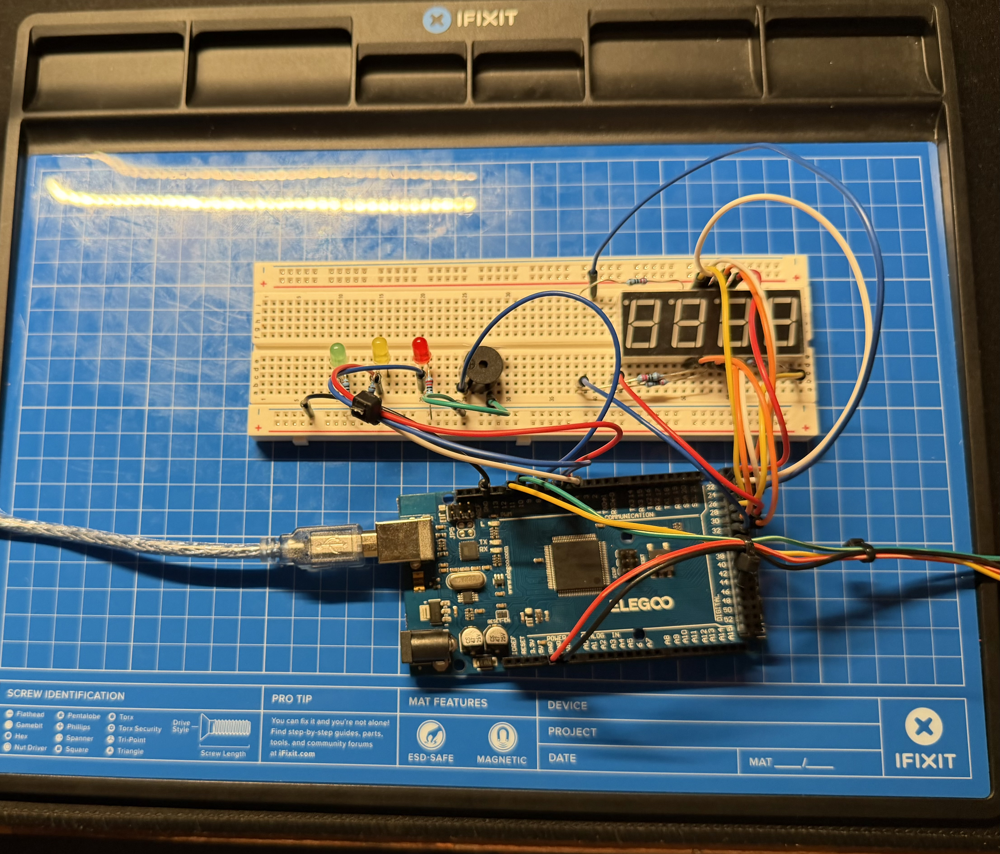
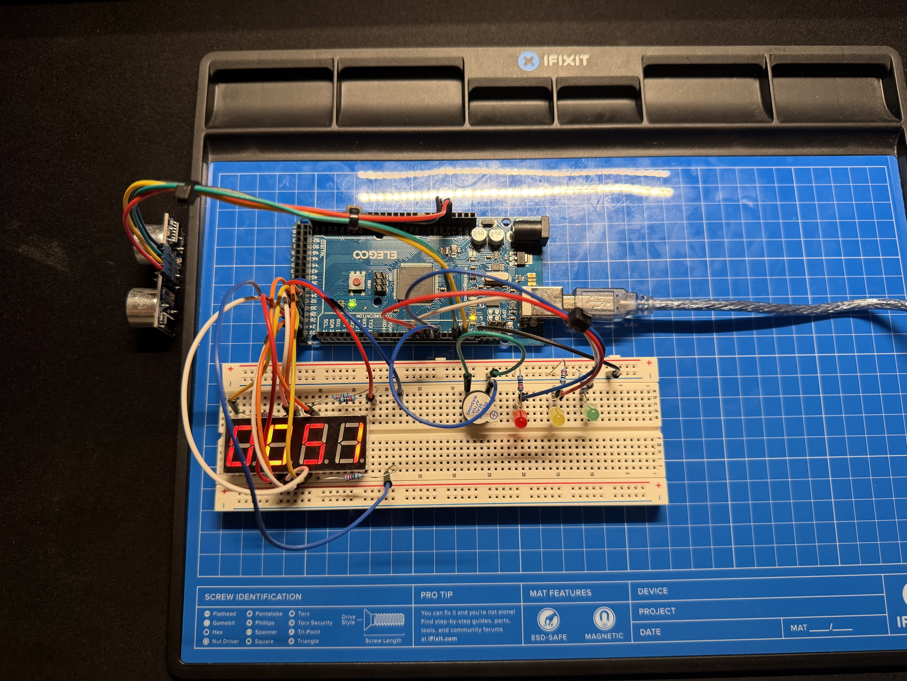
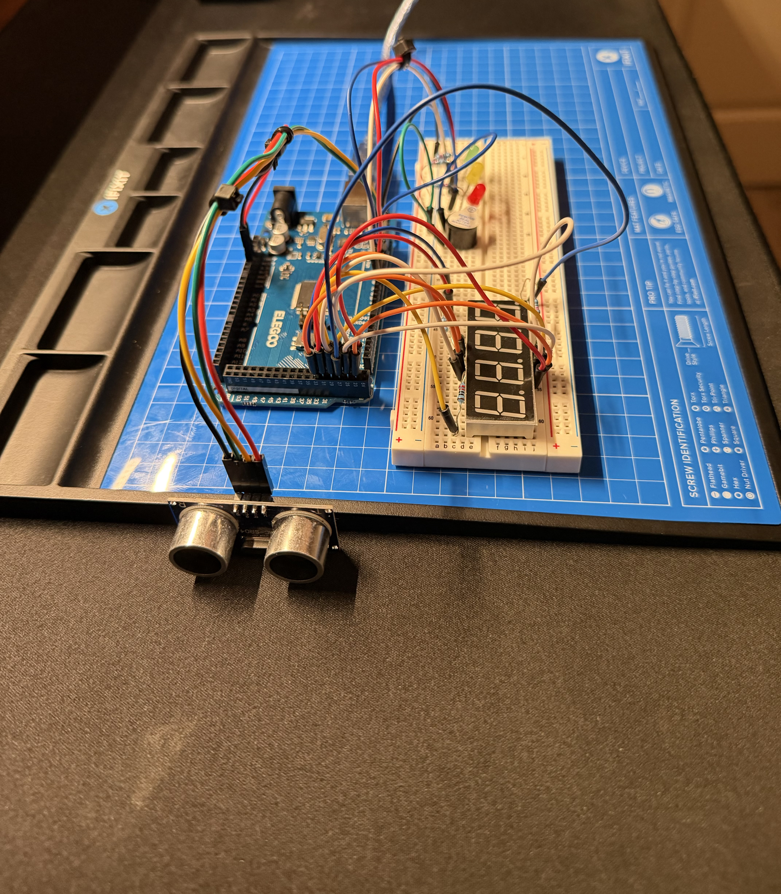

# Arduino Parking Sensor

This was my first ever Arduino project, and honestly my first time building anything out of individual electronic components like this. I have zero prior coding or hardware background going in. I did this in one sitting using an ELEGOO MEGA 2560 Most Complete Starter Kit, on Linux.

The end result is a working parking sensor: an ultrasonic sensor measures distance, three LEDs (green/yellow/red) show how close something is, a buzzer beeps faster the closer you get, and a 4-digit display shows the live distance in centimeters.






https://github.com/user-attachments/assets/332bfb4f-9fb1-409b-be44-55660f10aae1


## What it does
- Measures distance using an ultrasonic sensor (same tech bats use, sends out a sound pulse and times how long it takes to bounce back)
- Green light = clear, yellow = getting close, red = too close
- Buzzer beeps slow when you're in the yellow zone, speeds up as you get closer, and goes to a steady tone right up close
- 4-digit display shows the distance in cm in real time

## Hardware used
- ELEGOO Mega 2560 (Arduino-compatible board)
- HC-SR04 ultrasonic sensor
- 3 LEDs (green, yellow, red) + 220Ω resistors
- Active buzzer
- 5641AS 4-digit 7-segment display
- Breadboard + jumper wires

## The journey (aka what actually happened)

**Getting started was pretty straightforward.** I installed the Arduino IDE on Linux, ran into a permission error trying to upload code (had to add myself to the `dialout` group so the OS would let me talk to the board over USB), and once that was sorted, got the built-in LED blinking. I even broke it once by deleting a closing parenthesis while editing the code, which was a good first lesson in how picky compilers are about tiny syntax stuff.

**The distance sensor came together fast.** Wired up the HC-SR04, wrote code to send a pulse and time the echo, did the math to convert that into centimeters, and had live distance readings printing to my screen. This part just clicked.

**Adding the LEDs and buzzer was mostly smooth**, except the buzzer didn't make a sound at first. Turned out I had it in backwards. Flipped it around and it worked.

**The display is where I actually struggled.** It has 12 legs and none of them are labeled, so I spent a long time trying to guess which leg did what, plus fighting with getting wires into the right breadboard holes from photos, which is genuinely harder than it sounds. I eventually looked up the actual manufacturer pinout for this exact display (a 5641AS) instead of guessing, wired all 12 legs against that reference, and got it to show "1234" on the first real try after that. Big relief.

**Final step** was merging everything into one program and switching the timing over to use `millis()` instead of `delay()`, so the display keeps refreshing smoothly while the sensor and buzzer are doing their own thing in the background.

## What I learned
- Setting up an Arduino dev environment on Linux from scratch, including fixing serial port permissions
- Digital input/output, reading a sensor, writing to LEDs and a buzzer
- Debugging actual compiler errors instead of just reading about them
- Multiplexing a 4-digit display (lighting one digit at a time, fast enough that it looks like all four are on at once)
- Using `millis()` for timing instead of blocking `delay()` calls, so multiple things can happen "at once"
- How to actually read a datasheet instead of guessing

## Full code

```cpp
// Sensor
const int trigPin = 12;
const int echoPin = 11;

// LEDs and buzzer
const int greenPin = 5;
const int yellowPin = 6;
const int redPin = 7;
const int buzzerPin = 8;

// Display
const bool COMMON_CATHODE = true;
const int segmentPins[8] = {29, 33, 25, 23, 22, 30, 26, 24}; // A,B,C,D,E,F,G,DP
const int digitPins[4] = {28, 31, 32, 27}; // D1,D2,D3,D4

const byte numbers[10] = {
  B00111111, B00000110, B01011011, B01001111, B01100110,
  B01101101, B01111101, B00000111, B01111111, B01101111
};

unsigned long lastReadTime = 0;
int currentDistance = 0;

void setup() {
  pinMode(trigPin, OUTPUT);
  pinMode(echoPin, INPUT);
  pinMode(greenPin, OUTPUT);
  pinMode(yellowPin, OUTPUT);
  pinMode(redPin, OUTPUT);
  pinMode(buzzerPin, OUTPUT);

  for (int i = 0; i < 8; i++) pinMode(segmentPins[i], OUTPUT);
  for (int d = 0; d < 4; d++) { pinMode(digitPins[d], OUTPUT); digitOff(d); }

  Serial.begin(9600);
}

long readDistanceCm() {
  digitalWrite(trigPin, LOW);
  delayMicroseconds(2);
  digitalWrite(trigPin, HIGH);
  delayMicroseconds(10);
  digitalWrite(trigPin, LOW);
  long duration = pulseIn(echoPin, HIGH, 30000);
  return duration / 58;
}

void setSegments(byte pattern) {
  for (int i = 0; i < 8; i++) {
    bool on = bitRead(pattern, i);
    if (!COMMON_CATHODE) on = !on;
    digitalWrite(segmentPins[i], on ? HIGH : LOW);
  }
}
void digitOn(int d)  { digitalWrite(digitPins[d], COMMON_CATHODE ? LOW : HIGH); }
void digitOff(int d) { digitalWrite(digitPins[d], COMMON_CATHODE ? HIGH : LOW); }

void showNumber(int value) {
  int digits[4] = {(value/1000)%10, (value/100)%10, (value/10)%10, value%10};
  for (int d = 0; d < 4; d++) {
    setSegments(numbers[digits[d]]);
    digitOn(d);
    delay(3);
    digitOff(d);
  }
}

void loop() {
  if (millis() - lastReadTime >= 200) {
    currentDistance = readDistanceCm();
    lastReadTime = millis();

    Serial.print("Distance: ");
    Serial.println(currentDistance);

    digitalWrite(greenPin, LOW);
    digitalWrite(yellowPin, LOW);
    digitalWrite(redPin, LOW);
    digitalWrite(buzzerPin, LOW);

    if (currentDistance == 0 || currentDistance > 30) {
      digitalWrite(greenPin, HIGH);
    } else if (currentDistance > 15) {
      digitalWrite(yellowPin, HIGH);
    } else if (currentDistance > 5) {
      digitalWrite(redPin, HIGH);
      digitalWrite(buzzerPin, HIGH);
      delay(30);
      digitalWrite(buzzerPin, LOW);
    } else {
      digitalWrite(redPin, HIGH);
      digitalWrite(buzzerPin, HIGH);
    }
  }

  showNumber(currentDistance);
}
```

## Wiring

| Sensor | Mega pin |
|---|---|
| VCC | 5V |
| GND | GND |
| Trig | 12 |
| Echo | 11 |

| LED / buzzer | Mega pin |
|---|---|
| Green | 5 |
| Yellow | 6 |
| Red | 7 |
| Buzzer | 8 |

| Display pin | Mega pin | | Display pin | Mega pin |
|---|---|---|---|---|
| E | 22 | | D1 | 28 |
| D | 23 | | A | 29 |
| DP | 24 | | F | 30 |
| C | 25 | | D2 | 31 |
| G | 26 | | D3 | 32 |
| D4 | 27 | | B | 33 |

## Next steps
- Run it off the 9V battery instead of the laptop so it's fully standalone
- 3D print or box up an actual enclosure for it
- Maybe try adding a real bracket/mount for the sensor
